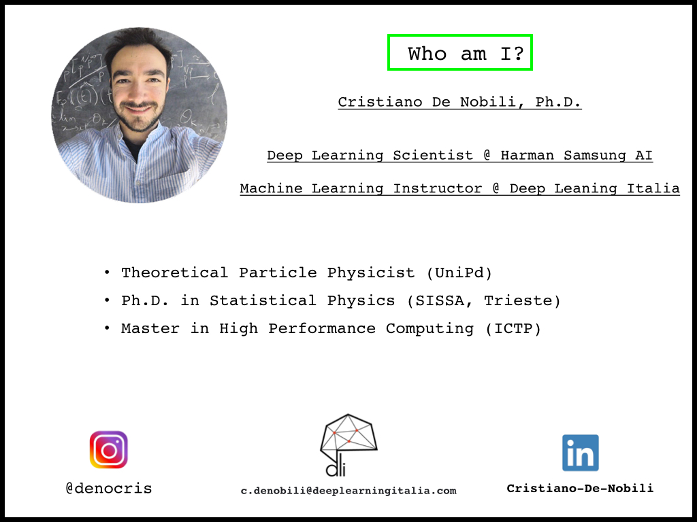

 <h1>Deep Learning for Natural Language Processing: an introduction</h1> 

These lectures were given by me at a Master in Data Science. The fisrt part (notebooks 01,02) explains data preprocessing, while the second part (notebook 03) is devoted to develop a simple text generator in TensorFlow.

## Presentation

## References

A lot of useful references about Machine Learning and Deep Learning can be found in refs.md file. Have a look at it and enjoy! 
